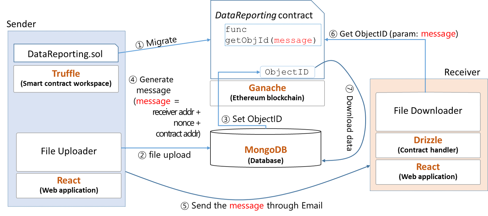

## DeCFES (Decentralized File Exchange System)

`DeFES` is a Web and Block chain application to provide a file exchange system. 





### Installation
This application uses [Ganache](https://www.trufflesuite.com/ganache) as a blockchain service. 


### Addtional installation step for Windows 10
To install node packages in Windows 10, the specific windows-build-tools version is required.

* `npm install -g --production windows-build-tools --vs2015`


**Example:**
```Node 
npm install
npm run dev
